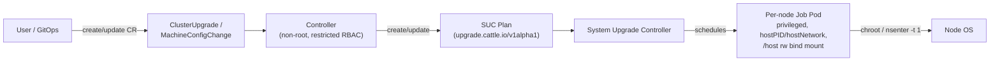

# Security Analysis: Cluster Management Controllers

This document analyzes the security posture of the two Kubernetes controllers `bootc-mke3` uses to automate cluster lifecycle operations, and lists concrete mitigations. Both controllers are vendored into this repository as git submodules for reference:

| Controller | Path | Upstream | Commit analyzed |
|---|---|---|---|
| cluster-upgrade-controller | `controllers/cluster-upgrade-controller` | `git@github.com:Mirantis/cluster-upgrade-controller.git` | `8d37c8d` (2026-07-16) |
| machine-config-controller | `controllers/machine-config-controller` | `git@github.com:Mirantis/machine-config-controller.git` | `6b2b670` (2026-07-16) |

> [!IMPORTANT]
> Both controllers depend on [Rancher's System Upgrade Controller (SUC)](https://github.com/rancher/system-upgrade-controller), which is *not* vendored here and is out of scope for source review, but its trust model is central to both controllers' security and is analyzed below based on how it is invoked and configured (`ansible/tasks/suc-priv-grant-tasks.yml`, `ansible/tasks/mke-upgrade-controller-tasks.yml`).

## 1. Shared architecture and trust model

Neither controller mutates node/host state directly. Both follow the same pattern:

- The **in-cluster controller pods** are low-privilege: non-root (UID 65532), `allowPrivilegeEscalation: false`, all Linux capabilities dropped, distroless base images with no shell.
- All privileged work happens in **SUC-scheduled Job Pods**, one per matched node, running `privileged: true`, host PID/network namespaces, and a read-write bind mount of the host root filesystem at `/host`. Scripts inside these Jobs use `chroot /host …` or `nsenter --target 1 …` to execute commands directly in the node's root/PID-1 namespace.
- **Consequence**: anyone who can create or edit the CR that drives a given controller (`ClusterUpgrade` or `MachineConfigChange`) — or who can directly create/edit the resulting `Plan` in the `system-upgrade` namespace — has **root-equivalent access to every node the Plan targets**. This is stated explicitly by the machine-config-controller project itself:

  > "Creating a `MachineConfigChange` is cluster-root-equivalent on every node it matches — the generated SUC `Plan` runs a privileged, host-PID, host-root-mounted job per node. RBAC `create` on this CRD should be treated like `cluster-admin`."
  > — `controllers/machine-config-controller/README.md:17-23`, `controllers/machine-config-controller/docs/reference.md:3-7`

  The same reasoning applies to `cluster-upgrade-controller`'s `ClusterUpgrade` CRD: it drives `bootc switch`, Docker daemon reconfiguration, and MKE3/MKE4 upgrade scripts through identical SUC Plans.

- **RBAC on the CRDs is therefore the primary security boundary**, not RBAC on the controllers' own ServiceAccounts (which are already tightly scoped — see below).

## 2. cluster-upgrade-controller

**Purpose**: orchestrates OS (`bootc`), MKE3, and MKE4 upgrades cluster-wide via a single `ClusterUpgrade` custom resource.

### 2.1 RBAC footprint

Source: `controllers/cluster-upgrade-controller/config/rbac/role.yaml:1-116` (mirrored in `chart/cluster-upgrade-controller/templates/rbac.yaml`), bound cluster-wide via `ClusterRoleBinding` to the `cluster-upgrade-controller` ServiceAccount.

| API group | Resource | Verbs | Purpose |
|---|---|---|---|
| `` (core) | `namespaces` | get, list, watch | verify `system-upgrade` exists |
| `` (core) | `nodes` | get, list, patch, watch | read node roles; patch `mke/version` label |
| `coordination.k8s.io` | `leases` | full CRUD + watch | leader election |
| `events.k8s.io` | `events` | create, patch | progress/failure events |
| `helm.k0s.k0sproject.io` | `charts` | get, list, watch | verify MKE4 component rollout |
| `kcm.k0rdent.mirantis.com` | `managements` | get, patch, update | trigger k0rdent cluster template rollout |
| `mke.mirantis.com` | `mkeconfigs` | get, list, patch, update, watch | patch MKE4 target version |
| `mke.mirantis.com` | `mkereleases` | create, get, list, patch, update, watch | manage MKE4 release CRs |
| `upgrade.cattle.io` | `plans` | full CRUD + watch | **create/manage SUC Plans — the privileged escalation point** |
| `upgrade.mirantis.com` | `clusterupgrades`(`/status`,`/finalizers`) | full CRUD + watch | own CRD lifecycle |

The `plans` grant is the load-bearing entry: it is how a low-privilege controller pod causes privileged, host-mutating Jobs to be scheduled without itself running privileged.

### 2.2 Pod/container hardening (already in place)

- `runAsNonRoot: true`, UID/GID 65532 — `chart/cluster-upgrade-controller/values.yaml:19-22`
- `allowPrivilegeEscalation: false`, `capabilities.drop: [ALL]`, `readOnlyRootFilesystem: true` — `values.yaml:24-29`
- Base image `gcr.io/distroless/static:nonroot`, no shell — `Dockerfile:1-14`
- No `hostNetwork`/`hostPID`/`hostPath` on the controller Deployment itself — `chart/cluster-upgrade-controller/templates/deployment.yaml`

### 2.3 What the generated Plans actually do on nodes

| Step (CRD field) | Script / action | Attacker-influenced input |
|---|---|---|
| `bootc-os` (`spec.os`) | `chroot /host bootc switch "$TARGET"`, then `nsenter -t 1 … systemctl --no-block reboot` — `internal/suc/plan.go:99-108` | `spec.os.image` (OCI ref, pattern-validated: `^[A-Za-z0-9][A-Za-z0-9._/:@-]*$`) |
| `mke3-upgrade` (`spec.product.mke3`) | `docker run mirantis/ucp upgrade --id <id> $MKE3_UPGRADE_FLAGS` against the host Docker socket | `spec.product.mke3.image`, `upgradeFlags` (**no pattern validation** — `internal/step/mke3_upgrade.go`) |
| `mke3-docker-config` | decode `DOCKER_DAEMON_CONFIG_B64`, write `/etc/docker/daemon.json`, `systemctl --no-block restart docker` | `spec.product.mke3.dockerDaemonConfig` (raw JSON, validated only for JSON syntax, not content) |
| `mke3-backup` | `docker run mirantis/ucp:<current> backup` → tar to host path | `spec.product.mke3.backupDir` (pattern-validated: `^/[A-Za-z0-9._/-]*$`) |
| `etcd-maintenance` | runs `/upgrade-etcd-maint.sh` from an OCI artifact on control-plane nodes | `spec.product.mke4.etcdMaintenance{Image,ArtifactRef}` |
| `mke`/`k0rdent` | patches `MkeRelease`/`Management` CRs; no direct node script | version strings only |

Existing mitigations the controller applies: image/path values are shell-quoted before interpolation (`internal/suc/plan.go:116-118`), one non-terminal `ClusterUpgrade` allowed cluster-wide (`internal/controller/clusterupgrade_controller.go:184-193`), control-plane upgrades serialized (`controlPlaneConcurrency` default 1) to preserve Swarm/etcd quorum, node drain before upgrade, idempotent/reboot-surviving scripts, finalizer-driven Plan cleanup on CR deletion.

**Gaps**: `spec.product.mke3.image`, `upgradeFlags`, and `dockerDaemonConfig` are **not** validated against an allowlist or registry policy — only `os.image` and `backupDir` have regex constraints. There is no admission webhook; all validation is CRD-schema-level or in-reconciler (post-admission).

### 2.4 Secrets, network, logging

- Controller reads no application secrets directly; uses its in-cluster ServiceAccount token only.
- `dockerDaemonConfig` may carry registry credentials embedded by the user; it is stored as plain CRD spec text (not a `Secret`), so it is readable by anyone with `get` on `ClusterUpgrade` objects and appears in etcd unencrypted unless [encryption at rest](#4-secrets--data-at-rest) is enabled.
- Metrics (`:8080/metrics`) and health (`:8081/healthz`,`/readyz`) are plain HTTP, **unauthenticated**, ClusterIP-only by default (`cmd/main.go:29-53`, `chart/cluster-upgrade-controller/templates/deployment.yaml:35-53`). No admission webhook server.
- Logging via `zap` in development mode by default (`cmd/main.go:39-40`) — verbose but not a security issue per se; recommend `Development: false` in production to avoid leaking stack traces.

## 3. machine-config-controller

**Purpose**: applies OS-level machine configuration (DNS resolvers, NTP, kernel `sysctl`) to nodes via the `MachineConfigChange` CRD.

### 3.1 RBAC footprint

Source: kubebuilder markers in `internal/controller/machineconfigchange_controller.go:64-69`, rendered to `charts/machine-config-controller/templates/{clusterrole,role,leader-election-role}.yaml`.

| Scope | API group | Resource | Verbs |
|---|---|---|---|
| Cluster | `config.machine-config-controller.io` | `machineconfigchanges`(`/status`) | get, list, watch, update, patch |
| Cluster | `` (core) | `events` | create, patch |
| Namespaced (`system-upgrade` by default) | `` (core) | `secrets` | get, list, watch, create, update, patch, **delete** |
| Namespaced | `` (core) | `serviceaccounts` | get, list, watch |
| Namespaced | `upgrade.cattle.io` | `plans` | get, list, watch, create, update, patch, delete |
| Namespaced | `coordination.k8s.io` | `leases` | full CRUD (leader election) |

Same escalation shape as `cluster-upgrade-controller`: the controller itself cannot touch a node, but its `plans` grant lets it cause SUC to schedule a privileged Job per matching node. The `secrets` grant (including `delete`) is scoped to the target namespace only — reasonably tight — but that namespace is the same one SUC uses to run privileged Jobs, so namespace-level access control matters (see §5).

### 3.2 Pod/container hardening (already in place)

- Controller: `runAsNonRoot: true`, `seccompProfile: RuntimeDefault`, `allowPrivilegeEscalation: false`, `capabilities.drop: [ALL]` — `charts/machine-config-controller/machine-config-controller/values.yaml:43-51`; base image `distroless/static:nonroot`, UID 65532 — `Dockerfile:10-13`.
- A **second image**, `Dockerfile.agent` (Alpine 3.20, digest-pinned), runs only inside SUC Job Pods, as root, with the packages (`bash`, `jq`, `util-linux`) the host-mutation scripts need. This is expected — it is the privileged half of the design — but it means the "agent" image is a second, root-running supply-chain surface that must be pinned and scanned like the controller image.

### 3.3 What the generated Plans actually do on nodes

Every module is dispatched by `apply.sh` (`internal/scripts/apply.sh:1-20`) from a per-CR `Secret` mounted into the Job, and **each has no semantic allowlisting beyond syntax**:

| Module | Script | Effect | CRD validation |
|---|---|---|---|
| `network` | `internal/scripts/network.sh:6-52` | Overwrites `/host/etc/resolv.conf` with attacker-supplied nameservers/search domains | none beyond string type |
| `ntp` | `internal/scripts/ntp.sh:6-36` | Overwrites `/host/etc/systemd/timesyncd.conf`; `nsenter --target 1 … systemctl enable --now systemd-timesyncd` | none beyond string type |
| `kernel` | `internal/scripts/kernel.sh:6-59` | Writes `/etc/sysctl.d/90-machine-config-controller.conf`; `nsenter --target 1 … sysctl --system` | CEL regex requires dotted key syntax (`^[a-zA-Z_][a-zA-Z0-9_]*([.][a-zA-Z0-9_-]+)+$`) and rejects control characters in values — **no allowlist of which sysctl keys are safe** (e.g. `kernel.core_pattern`, `kernel.modules_disabled`, `net.ipv4.ip_forward` are all settable) |

`apply.sh` also has no validation of which top-level `config.json` keys map to which script — it will execute any `<key>.sh` present, so the blast radius is bounded only by which scripts ship in the agent image today.

Existing mitigation: the controller pre-checks that `spec.rollout.serviceAccountName` (default `system-upgrade`) exists before creating the Plan, preventing SUC from being pointed at an arbitrary/nonexistent SA (`internal/controller/machineconfigchange_controller.go:229-234, 314-319`). Each managed file is backed up once (`*.mcc-orig`) as a manual revert path — there is **no automatic rollback** on failure.

### 3.4 Secrets, network, logging

- The controller writes the full rendered script bundle **and** `config.json` into a `Secret` per CR (`internal/controller/machineconfigchange_controller.go:182-212`) — plaintext at rest in etcd absent encryption-at-rest; readable by anyone with `get secrets` in the target namespace.
- Metrics (`:8080`) and health (`:8081`) endpoints are unauthenticated, same pattern as cluster-upgrade-controller (`cmd/main.go:33-37`, `charts/.../templates/deployment.yaml:28-46`).
- No admission webhook; all validation is CRD-schema (CEL/regex) only.

## 4. Cluster-wide risk factors introduced at install time

The Ansible tooling in this repo grants broader-than-controller-scoped privileges to make SUC work at all, and does so **unconditionally whenever `deploy_suc: true`** (the default):

- `ansible/tasks/suc-priv-grant-tasks.yml` adds `system-upgrade:system-upgrade` to MKE's `UCPAuthorization` allowlist for `privileged, hostIPC, hostNetwork, hostPID, hostBindMounts, kernelCapabilities` — correctly scoped to the SUC service account.
- The same task also sets **`enable_admin_ucp_scheduling = true`** cluster-wide, which lets **all authenticated users and service accounts** (not just SUC) schedule pods on manager and MSR nodes — this is broader than SUC needs and increases blast radius for any other workload an attacker manages to schedule.
- It also grants the **`Scheduler` role to the `authenticated` alias** (all authenticated users) on the root Swarm collection — again broader than "let SUC's SA schedule privileged jobs."

These two grants are MKE-wide policy changes, not scoped to the SUC ServiceAccount, and should be treated as part of this analysis's blast radius even though they originate in Ansible rather than the controllers.

## 5. Consolidated risk register

| # | Risk | Component | Impact | Mitigation status |
|---|---|---|---|---|
| R1 | `create`/`update` on `ClusterUpgrade` or `MachineConfigChange` = root on every matched node | Both | Full node/cluster compromise | Documented by upstream; **not enforced by RBAC in this repo's default install** |
| R2 | `create`/`update` on `Plan` objects in `system-upgrade` namespace bypasses the controllers entirely and achieves the same privileged execution | Both (SUC) | Full node compromise | Not restricted by default namespaced RBAC |
| R3 | `enable_admin_ucp_scheduling=true` + `authenticated`→`Scheduler` grant let any authenticated principal schedule on manager/MSR nodes | Ansible/MKE | Privilege escalation beyond SUC's needs | Applied unconditionally when `deploy_suc: true` |
| R4 | `mke3.image`, `upgradeFlags`, `dockerDaemonConfig` unvalidated beyond JSON/string-type | cluster-upgrade-controller | Arbitrary image execution / Docker daemon takeover with attacker-controlled `ClusterUpgrade` write access | No registry allowlist, no admission webhook |
| R5 | Arbitrary `sysctl` keys, DNS resolvers, NTP servers with only syntax validation | machine-config-controller | Kernel hardening bypass (e.g. `kernel.core_pattern`), DNS hijack, time-based auth bypass | CEL regex on syntax only, no semantic allowlist |
| R6 | Full script bundle + config stored as plaintext `Secret`/CRD spec | Both | Credential/config disclosure if etcd or `get secrets` access is obtained | No encryption at rest by default |
| R7 | Unauthenticated `:8080`/`:8081` metrics & health endpoints | Both | Info disclosure (controller-runtime metrics); reconnaissance | No NetworkPolicy shipped by default |
| R8 | No automatic rollback on `machine-config-controller` failure; single manual `.mcc-orig` backup | machine-config-controller | Partial/failed config change may leave nodes in inconsistent state | Manual recovery only |
| R9 | Agent image (`Dockerfile.agent`, Alpine, root) is a second supply-chain surface | machine-config-controller | Compromise of agent image = compromise of every node it runs on | Digest-pinned base, otherwise same trust level as controller image |

## 6. Mitigation checklist

Ordered by leverage (highest-impact / lowest-effort first):

1. **Treat the CRDs as cluster-admin.** Restrict `create`/`update`/`delete` RBAC on `clusterupgrades.upgrade.mirantis.com` and `machineconfigchanges.config.machine-config-controller.io` to a small, audited admin group. Do not grant broadly (R1).
2. **Lock down the `system-upgrade` namespace.** Deny direct `create`/`update` on `plans.upgrade.cattle.io` and `secrets` in that namespace to everyone except the two controllers' ServiceAccounts and SUC itself; this closes the bypass path (R2).
3. **Re-scope the MKE scheduling grants after install.** Audit whether `enable_admin_ucp_scheduling` and the `authenticated`→`Scheduler` grant are still required once SUC is running; if MKE supports scoping the privileged/scheduling attributes to a named SA/team instead of "all authenticated," prefer that over the current cluster-wide toggle (R3). See [hardening runbook](runbooks/harden-mke3-kubernetes.md).
4. **Add a registry/content allowlist** (e.g. an admission policy via Kyverno/OPA Gatekeeper, or a validating webhook) for every attacker-influenced OCI reference: `spec.os.image`, `spec.product.mke3.image`, `spec.product.mke4.etcdMaintenance{Image,ArtifactRef}` (R4).
5. **Add a semantic sysctl allowlist** in front of `MachineConfigChange` (admission policy) that blocks known-dangerous keys (`kernel.core_pattern`, `kernel.modules_disabled`, etc.) rather than relying on syntax validation alone (R5).
6. **Enable etcd encryption at rest** (`EncryptionConfiguration` on the API server) so the `Secret`/CRD-spec payloads in R6 are not plaintext on disk.
7. **Apply NetworkPolicies** restricting `:8080`/`:8081` on both controllers to the monitoring namespace only (R7).
8. **Define and test a rollback procedure** for `MachineConfigChange` beyond the `.mcc-orig` backup — e.g. a documented "revert CR" pattern — before relying on it in production (R8).
9. **Pin and scan the agent image** (`Dockerfile.agent`) in the same CI/image-scanning pipeline as the controller image; do not treat it as lower-risk because it "just runs scripts" (R9).
10. **Enable Kubernetes audit logging** for `create`/`update`/`delete` on both CRDs, `plans`, and `secrets` in `system-upgrade`, so any use of the escalation paths above is attributable.
11. **Set `zap.Options{Development: false}`** (or the chart equivalent) for both controllers in production to avoid verbose stack traces in logs.

## 7. References

- `controllers/cluster-upgrade-controller/docs/architecture.md`, `docs/reference.md`
- `controllers/machine-config-controller/docs/architecture.md`, `docs/reference.md`, `README.md#security-model`
- [Rancher System Upgrade Controller](https://github.com/rancher/system-upgrade-controller)
- `ansible/tasks/suc-priv-grant-tasks.yml`, `ansible/tasks/mke-upgrade-controller-tasks.yml`
- Companion runbook: [Harden MKE3 / Kubernetes](runbooks/harden-mke3-kubernetes.md)
